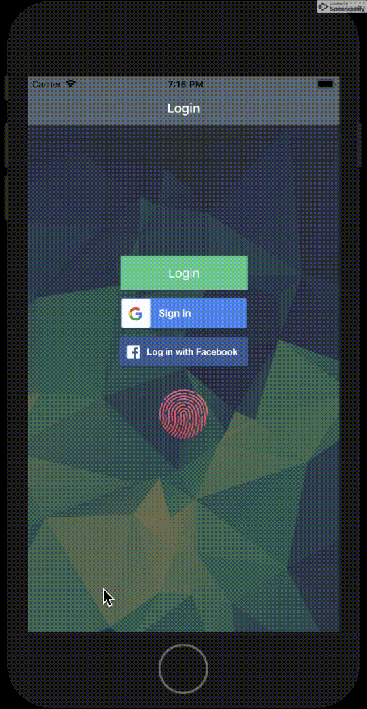
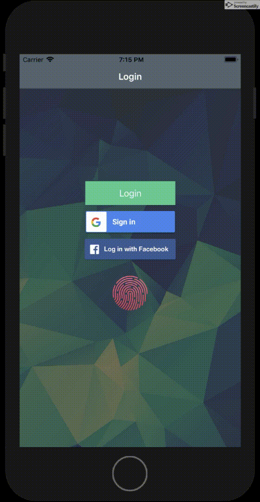
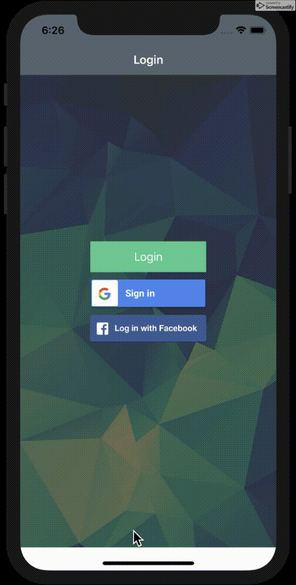
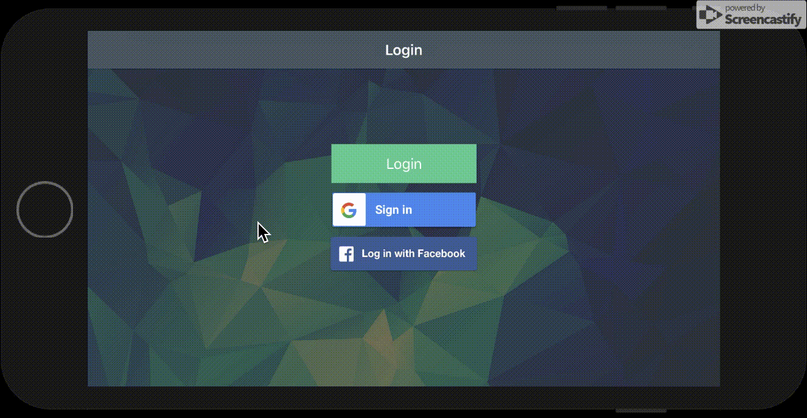

# Swifty Proteins

#### SwiftyProteins is a 3D visualizer for proteins models according to standardized representation from the PDB   ([Protein Data Bank](https://www.rcsb.org/)) using SceneKit.

In this project I used: rcsb.org, MVC, FBSDKCoreKit, FBSDKLoginKit, GoogleSignIn, Alamofire, SwiftyJSON, SVProgressHUD, ChameleonFramework, SceneKit.

To watch app in work please wait for .gif files upload:

Launch Screen         | Touch ID Success     |  Touch ID Failure
:--------------------:|:--------------------:|:--------------------|
       |   |  

Login Free            | Google Auth          |  Facebook Auth
:--------------------:|:--------------------:|:--------------------|
        |       |  

Random protein        |  Protein Scene View  |  Save To Gallery
:--------------------:|:--------------------:|:--------------------|
       |      |  

Landscape View #1      |  Landscape View #2
:---------------------:|:----------------------:|
    |  

### Mandatory part
Before begining the core of the projet add an icon to your application AND a  
Launchscreen and make sure the launchscreen stays some time so we can appreciate it!  

#### Login ViewController:
• A user must be able to login with Touch ID using a button  
• If login fails you must display a popup warning authentication failed  
• If the iPhone is not compatible the Touch ID login button should be hidden  
• The LoginViewController should ALWAYS be displayed when launching the app meaning  
&nbsp;&nbsp; if you press the Home button and relaunch the app whitout quitting it,  
&nbsp;&nbsp; it should show the LoginViewController !  
#### Protein List ViewController:
• You must list all the ligands provided in ligands.txt (see resources)  
• You should be able to search a ligand through the list  
• If you cannot load the ligand through the website display a warning popup  
• When loading the ligand you should display the spinning wheel of the activity monitor  
#### Protein ViewController:
• Display the ligand model in 3D  
• You must use CPK coloring  
• You should at least represent the ligand using Balls and Sticks model  
• When clicking on an atom display the atom type (C, H, O, etc.)  
• Share your modelisation through a ‘Share‘ button  
• You should be able to ‘play‘ (zoom, rotate...) with the ligand in Scene Kit  

### Bonus
• Use of custom cells  
• Design  
• Custom popup  
• Other modelisation available  
• Custom message when sharing your screenshot  
• ....  

### Authors
I've done this project with my awesome teammate [@oskulska](https://github.com/oskul).

#### More about School 42 and UNIT Factory you can find here: https://en.wikipedia.org/wiki/42_(school)
