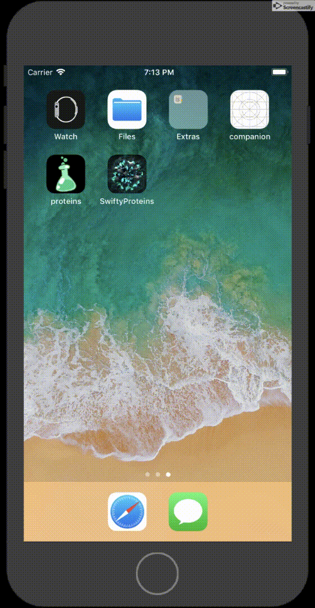

# Swifty Proteins

#### SwiftyProteins is a 3D visualizer for proteins models according to standardized representation from the famous PDB ([Protein Data Bank](https://www.rcsb.org/)) using SceneKit.

In this project I used: rcsb.org, MVC, FBSDKCoreKit, FBSDKLoginKit, GoogleSignIn, Alamofire, SwiftyJSON, SVProgressHUD, ChameleonFramework, SceneKit.

To watch app in work please wait for .gif files upload:

Launch Screen         | Touch ID Success     |  Touch ID Failure
:--------------------:|:--------------------:|:--------------------|
       |   |  

Login Free            | Google Auth          |  Facebook Auth
:--------------------:|:--------------------:|:--------------------|
        |       |  

Random protein        |  Protein Scene View  |  Save To Gallery
:--------------------:|:--------------------:|:--------------------|
       |      |  

Landscape View #1      |  Landscape View #2
:---------------------:|:----------------------:|
    |  
